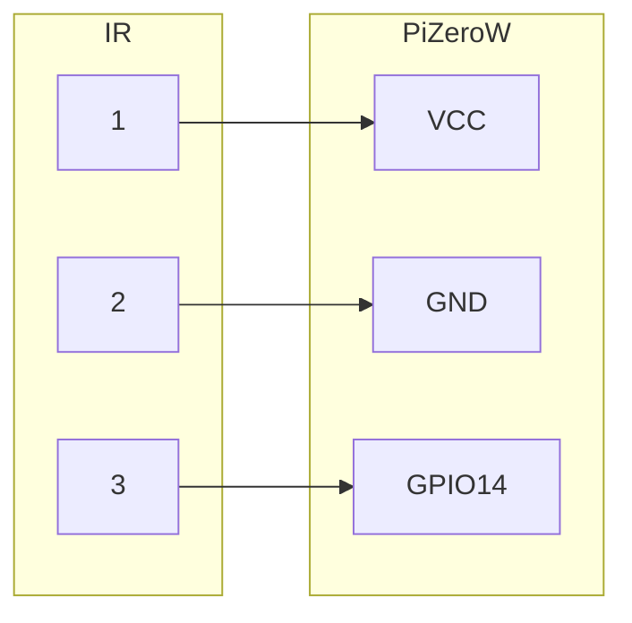

# Infrared analyser

* Receiver Module: OSRB38C9AA
* Environment: Raspberry Pi Zero W

## Schematic


```mermaid
flowchart LR
  subgraph IR
    1
    2
    3
  end
  subgraph PiZeroW
     VCC
     GND
     GPIO14
   end
  1 --> VCC
  2  --> GND
  3 --> GPIO14
```

## Usage

```
$ ./rectick.py
^C

$ ./dectick.py ir_signal.json 1 | ./kadenkyo.py
```

